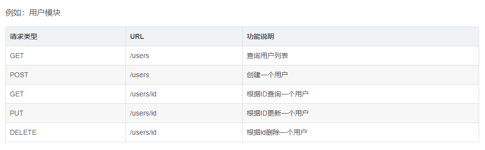

## 项目技术
> 
> spring boot 2.3 +  mybatis + mybatis-plus

## security

用户名：Jone   密码：admin
先登录，再访问接口


登录访问接口： 
```
url:  localhost:18088/server/login
method: post
参数： 
username = Jone
password = admin


```
新增用户接口：
```
url:  localhost:18088/server/user/insertOrUpdate
method: post

请求参数：
{
    "name": "admin",
    "phone": "17783715510",
    "password": "",  
    "gender": "M",
    "role": "ADMIN",
    "age": 20
}

注意：password为空时，默认取手机号后6位作为密码！！

响应结果：
{
    "code": "00",
    "message": "success"
}

```


## Restful风格

- 新增：@PostMapping("")
- 修改：@PutMapping("/{id}")
- 查询详情：@GetMapping("/{id}")
- 列表：@GetMapping("")
- 删除：@DeleteMapping("/{id}")

例如：


## API访问
localhost:18088/server/user/add


## 代码生成器
- 执行MpGenerator类里面的main方法（先修改main方法里面的配置）
- 然后将temp文件下面的文件拷贝到对应的目录下面即可

## 参考文档
简单接入security做权限控制： https://www.cnblogs.com/guos/archive/2019/10/02/11617243.html